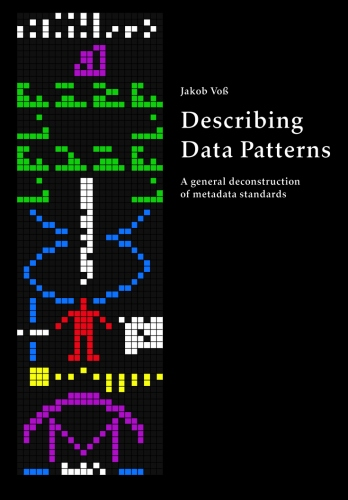

# Describing Data Patterns

This git repository contains the source code of my PhD thesis *Describing Data
Patterns*, submitted January 2013 at Humboldt University Berlin. The latest
version of the repository including errata can be found at
<https://github.com/jakobib/phdthesis2013>.

The pattern language of data structuring (chapter 5) is contained in another
git repository that is included as git submodule from
<https://github.com/jakobib/datapatterns2013>.

Feedback is highly appreciated, for instance public via
<https://github.com/jakobib/phdthesis2013/issues>.

## Citation

I suggest the following bibliographic metadata, also
[available at BibSonomy](http://www.bibsonomy.org/bibtex/2220c96bb2ad9a57367cb15378aef31a1):

    @phdthesis{Voss2013,
        author  = {Voß, Jakob},
        title   = {Describing Data Patterns. A general deconstruction of metadata standards},
        year    = {2013},
        school  = {Humboldt University},
        address = {Berlin},
        isbn    = {1-4909-3186-4},
        urn     = {urn:nbn:de:kobv:11-100212118}
    }

## Document versions and variants

Multiple versions and variants of the thesis exists with different paper format
and minor changes. Each version should be buildable by checking out a tagged
revision from the git repository:

* A versions published as book at print-on-demand publisher CreateSpace with
  **ISBN 1-4909-3186-4**. Paper format is 6.69 inch x 9.61 inch. Copies can be
  ordered for $12.80, 10.24€, £10.24, ￥1.985 or less via

    * [CreateSpace](https://www.createspace.com/4351505)
    * [Amazon.com](http://amzn.com/1490931864),
      [Amazon.co.uk](http://amazon.co.uk/dp/1490931864/), 
      [Amazon.de](http://www.amazon.de/dp/1490931864/) 
      [Amazon.co.jp](http://www.amazon.co.jp/dp/1490931864) and other countries
    * [Barnes&Noble](http://www.barnesandnoble.com/w/describing-data-patterns-jakob-voss/1116359218?ean=9781490931869)
      and library distributors such as [Ingram](http://www.ingramcontent.com/), 
      [NACSCORP](http://www.nacscorp.com/), and 
      [Baker & Taylor](http://www.btol.com/).
    * Additional certified CreateSpace resellers, e.g.
      [Lightning](https://www.lightningsource.com/)

  This version is tagged as `pod-20130805`.

* The PDF version archived
  [at Humboldt University document server](http://edoc.hu-berlin.de/dissertationen/voss-jakob-2013-05-31/) 
  and [at German National Library](http://d-nb.info/1041284497).
  Paper format is A4 in black and white with same pagination as
  the print-on-demand version. This version is tagged as `deposit-20130807`.

* The same A4 PDF but with color, available
  [via ResearchGate](https://www.researchgate.net/publication/255711288_Describing_Data_Patterns._A_general_deconstruction_of_metadata_standards).

* The version originally submitted for review in January 2013. The document is
  printed in A4 paper format and tagged as `submision-20130107`.

## Using this repository

To get the content of this repository, clone it including its submodules:

    git clone --recursive https://github.org/jakobib/phdthesis2013.git

The thesis is mainly written in LaTeX (with parts of chapter 5 written in
Pandoc Markdown). To build the document as PDF one requires at least LaTeX,
Pandoc, Perl, BibLaTeX with biber, Perl, GraphViz, and dot2tex.

Given the required packages, one should be able to create a PDF with:

    make patterns
    # ... manually adjust image size by adding "scale=0.4"
    make new

## License

The content of this repository is licensed under CC-BY-SA: feel free to copy,
distribute, modify, merge, request changes etc, as long as the result is also
licensed under CC-BY-SA and attribution is explicitly given to Jakob Voß.
