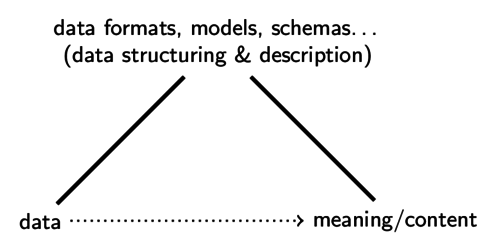
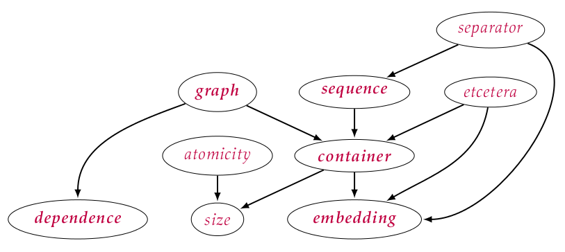

<!--
The Body of the summary paper should provide a comprehensive summary of the
dissertation, introducing, for instance, the topic, the research context and
questions, the theoretical or contextual framework, the methodology and
methods, and the findings. The summary paper should be written for blind
review; hence, all identifying information should be removed from the body of
the paper and, as necessary, the references.

* Significance of the research problem to today’s challenges and opportunities
* Scholarly contribution to the literature in any information related disciplines
* Application and rigor of the appropriate research methods
* Clarity and organization of the presentation.
-->

> We do not, it seems, have a very clear and commonly agreed upon set of notions
> about data. \cite{Mealy1967}

# Introduction

Despite the ubiquity and relevance of data and digital documents, their actual
nature has not been studied deeply in library and information science. Existing
approaches --- see \textcite{Buckland1998}, \textcite{Pedauque2006}, and
\textcite{Skare2007} --- focus on theoretical aspects and document content
rather than the forms that data is found in practice. One reason for this lack
of research is the overwhelming fluid plethora of methods, technologies,
formats, standards, and languages to structure and describe data. This
diversity applies to both, digital documents collected by library institutions,
and metadata used to describe digital documents. This thesis, nevertheless,
studies the entirety of data to reveal the way that digital documents are
basically structured and described independently from hypes and trends. Apart
from the bit as basic building block of data there will unlikely be one final
method of data structuring and description. For this reason the goal of the
thesis is not an unified (meta)data model but "another look at data" as
\textcite{Mealy1967} titled his early work on data theory. To do so, actual
methods of data structuring and description are carefully analyze, related, and
described by phenomenological research method. The study results in
a categorization by six fundamental prototypes, a list of five basic data
paradigms and a pattern language of data structuring.

## Related work

Both, the scope of this thesis, and its method applied to the revealing of
general patterns in data description and structuring are novel. Nevertheless
there are works of intellectual data analysis^[As described below, this kind of
data analysis should not be confused with statistical methods that build on
a different notion of data.] in particular domains: \textcite{Armstrong2006}
identified common patterns in Object Orientation by literature analysis.
\textcite{Dattolo2007a} analyzed patterns in hierarchical documents, with focus
on XML based languages. Conceptual data modeling literature with focus on
problems in business enterprises provides some further collections of patterns
by \textcite{Hay1995}, and by \textcite{Silverston2001}. More general patterns,
also limited to conceptual modeling are given by \textcite{Hay2006}, by
\textcite{Silverston2009}, and by \textcite{Blaha2010}. Literature on
metamodels and strict mathematical notations, such as by \textcite{OMG2009} and
by \textcite{Keet2008a} are relevant but also limited given the lack of rigor
in data modeling practice \cite{Simsion2007}. More practical publications
include review articles that summarize and compare specific technologies of
data structuring. Examples include \textcite{Kerschberg1976} with a taxonomy of
database models, \textcite{Kent1983b} with a taxonomy of entity-relationship
models, and \textcite{Riley2010} with a broad overview of metadata formats and
technologies. Critical treatment of data and digital documents that influenced
this thesis can also be found in works of \textcite{Kent2003} and
\textcite{Nelson1999}. The most similar works compared to this thesis' result
are ISO 11404 (\citeyear{ISO11404}) with a collection of language independent
data types \cite{Meek1994a}, and the model of \textcite{Honig1975}. Honig
conducted a survey of data structures in 21 representative programming
languages and database management systems, resulting in a description model
with core properties, such as homogeneity, atomicity, repeatability etc.,
similar to the patterns identified in this thesis. Honig's results, ISO 11404,
and \textcite{Armstrong2006} are successfully used in this thesis for
evaluation of the pattern language (section 5.6). The pattern language approach
has already been adopted in other fields of engineering, especially in software
engineering \cite{Gamma1994,Cunnigham1995}. These design patterns, however,
refer to the creation of dynamic computer programs, while digital documents as
analyzed in this thesis are static.
 
## Research question

Given the multiplicity of data, metadata and digital documents the aim of this
thesis is to find commonalities among different methods to structure and
describe data. The basic question is

> How is data actually structured and described?

Instead of just naming existing methods, such as Unicode, the Extensible Markup
Language (XML), the Resource Description Framework (RDF), Backus-Naur-Form
(BNF), and the Entity-Relationship-Model (ERM), an appropriate answer to this
question should identify common features that exist independent from particular
trends and technologies. Thus the more specific research question is

> What common features can be identified in different methods
> of data structuring and description, independent from
> particular technologies and trends?

The study begins with an analysis of data studied as semiotic signs.

# Analysis of Data

Both library and information science and computer science refer to information
as primary concept while data is only used as secondary concept or even
synonymously to information \cite{Gray2003}. Despite the early call of
\textcite{Naur1966}, there is little serious study of data as primary object of
research as conducted in this thesis. In most cases data is taken as "something
given" as indicated by the Latin root of the word. The best analysis of data in
its modern sense is given by the philosophers Floridi and 
Ballsun-Stanton (section 2.4).

## Data as being distinct

The *diaphoric definition of data* by \textcite{Floridi2010} defines data as

> *x* being distinct from *y*, where *x* and *y* are two uninterpreted
> variables and the relation of 'being distinct', as well as the domain,
> are left open to further interpretation.

This definition links data to some agreement of identity. On the lowest level
the problem is solved in practical data processing by introduction of two
distinct values (true and false or zero and one) that constitute all digital
data. For the scope of this thesis, all data is assumed to be digital,
eventually given as sequence of bits. Floridi further distinguishes three types
of data: data *de re* and data *de signo* is a lack of uniformity between
existing things and between perceived physical states or signals,
respectively. Both are only relevant in digital documents for the act of
digitization. The third type of data *de dicto* is defined as a lack of
uniformity between symbols, for example between the letters A and B. Data de
dicto can be expressed in digital form and it can be structured and described
by other data (metadata) as done with the data methods analyzed in this thesis.

## Notions of Data

\textcite{BallsunStanton2012} in his thesis identified three general notions
that people refer to when talking about data:

* **data as hard numbers** or **data as facts** are **hard numbers** reflect
  the scientific view. In this notion data are results of reproducible
  measurement and careful, objective consideration. Typical examples include
  numbers, such as the distance between earth and sun.

* **data as recorded observations** are subjective. They require context and
  must be filtered to extract useful information. Examples include
  notes in a research diary and audio recordings.

* **data as communications** or **data as bits** are digital signs used for
  communication. In this notion of data the relation between data and 
  objective or subjective reality is secondary compared to the semiotic
  character of data.

Most existing studies and handbooks of data are limited to "numeric" notions of
data as hard numbers, facts or recorded observations. Typical  methods of 
data analysis and data mining do not take into account the third notion of data
as signs as applied in this thesis.

## Data as signs and digital documents

This study of data concentrates on the notion of data as digital signs. Some
general insights from semiotics helped to underpin the research and its
relevance for library and information science (section 2.5). 

First, data have meaning and content only mediated and only by (arbitrary)
convention. A sign is part of an interaction, which \textcite{Peirce1931b}
refers to as semiosis. Semiosis involves the form of a sign (representamen),
a mental effect or thought (interpretant), and the thing for which it stands
(object or referent). A piece of data as representamen does not have a specific
meaning or content as referent but it is "used by someone to stand for
a referent" \cite{Ogden1923}. This connection must be mediated by methods of
data structuring and description, such as data formats, models, and schemas
(figure 1). 
 

Second, the triadic connection is embedded in a chain of unlimited semiosis
\cite{Eco1979}: if methods of data structuring and description are given in
digital form, they become signs in their own right, also to be interpreted by
mediation and convention. For this reason there is no inherent difference
between data and metadata and the results of this thesis apply to both.

Finally, a semiotic view at data as signs best fits to the concept of digital
documents in library and information science. The primary role of library
institutions in the digital age is not to make use of digital documents -- this
is done by readers and researchers doing data science or other business.
Libraries must rather ensure that all kinds of published and archived data
(research data, digital publications etc.) can be used as signs. Therefore, the
terms data piece/object/artifact/element/etc. and digital document can be used
interchangeably within the scope of this thesis and its insights to data
structuring and description will also help to better understand digital
documents.

## Research method

The research method of this thesis is a *phenomenological* method: Data is
viewed as social artifacts, that cannot be described from an absolute,
objective point of view. Instead occurrences of data are studied as
"'phenomena': appearances of things, or things as they appear in our
experience" \cite{Smith2009}. These phenomena are studied by phenomenon
investigated as described by \textcite[681ff.]{Spiegelberg1982} in three steps:
phenomenological intuiting, phenomenological analyzing, and phenomenological
describing. The phenomenological research method is justified by limitations of
existing approaches, which are either normative or quantitative: Normative data
descriptions do not necessarily reflect existing data, because standards and
technologies are often (mis)interpreted, ignored, and changed. Quantitative
studies, on the other hand, require a predefined set of structures, for
instance 'records' and 'fields' to apply statistical methods on. The goal of
this thesis, however, is to find out which of these structures exist in
practice and how these structures interact with each other.

# Methods of data structuring

The main empirical part of this thesis consists of a comprehensive analysis of
methods and systems for structuring and describing data from different fields
of application (chapter 3). The analysis focuses on conceptual properties. The
methods were examined and experienced critically by phenomenological intuiting,
following the advise of \textcite{Meek1995} "to develop a healthy disrespect
for all languages, and look for faults in them all the time." A collection and
analysis of different methods from such a wide range of data handling is novel
in its own right: the collection includes: 

* basic methods, such as **character and number encodings** (Unicode, IEEE 754)
  and **identifier systems** (ISBN, URN, DOI...),
* **file system** principles (names, attributes, folders, archives...) and
  **database** architectures (records, relational, objects, NoSQL...),
* **data structuring languages** (binding languages, INI, CSV, JSON, YAML, XML, RDF)
  and **markup languages** (SGML, HTML, Markdown, LaTeX...),
* **schema languages** (regular expressions, BNF, DTD, XSD, RELAX NG, RDFS, OWL, SQL...)
  and **modeling languages** (ERM, ORM2, UML...),
* **conceptual diagrams** and **query languages**.

The methods were grouped by phenomenological analysis without adhering to known
concepts and categories. This grouping resulted in a categorization of data
structuring methods (section 4.1): each of six prototypes illustrates
a possible primary purpose of a method of data structuring. Such methods in
practice are often used and misused for multiple purposes (the proverb "if all
you have is a hammer, everything looks like a nail" also applies to data
technologies), so the prototype categorization can be help to better grasp the
actual nature of a method, which may differ from its originally intended
purpose. The resulting prototypes are listed in table 1.

 prototype                      primary purpose   examples
------------------------------ ----------------- -----------------
encoding                        express data      Unicode, Base64
storage system                  store data        NTFS, RDBMS
identifier/query language       refer to data     URI, XPath
structuring/markup languages    structure data    XML, CSV, RDF
schema language                 constrain data    BNF, XSD
conceptual model                explain data      Mind Maps, ERM

Table: Prototype categorization of data structuring methods

# Paradigms

The second result of this thesis is a set of general paradigms, each described
with its benefits and drawbacks (section 4.2). The paradigms deeply shape the
way people talk and think about data. More subliminal than concrete
technologies, paradigms in data structuring come with their own basic (often
hidden) assumptions and influence which data patterns are actually used. The
data paradigms collected in this thesis describe general kinds of viewing at and
dealing with data and with digital documents. Then can help to better find
blind spots in existing applications and to avoid gaps or needless complexity
in future data modeling. In short, the five paradigms are:

* **Documents and objects** realize digital documents as given or as created
  artifacts.

* **Standards and rules** specify the consistent creation and consumption of
  data, show which parts of a document are possible and relevant, and how 
  to make use of data.

* **Collections, types and sameness**
  group parts of digital documents based on their identities.

* **Entities and connections** seem to be basic building blocks, but
  they are two sides of the same coin.

* **Levels of abstraction** separate and combine descriptions of the same
  document with different granularity.

The description of paradigms can be exemplified with *entities and
connections*: Both entities and connections exist in many forms and names ---
the former for instance as 'objects', 'records', 'files', 'items', or
'resources', and the latter as 'links', 'relationships', 'associations',
'pointers', etc. This dichotomy is useful to separate independent, primary
elements on the one side and dependent, secondary elements on the other side.
The downside, however, is the intrinsic arbitrariness of such partition:
a secondary connection between author and document in one data format may be
a primary authorship entity in another. Switching between such views is
difficult both mentally and practically as one can see for instance at
problems of reification in RDF.

# Data Patterns

The third and major result of this thesis is a pattern language of structures in
data. Patterns as systematic tools for describing good design practice were
first introduced by \textcite{Alexander1977} in the area of architecture. In
their definition

> each pattern describes a problem which occurs over and over again in our
> environment, and then describes the core of the solution to that problem, 
> in such a way that you can use this solution a million times over, without
> ever doing it the same way twice.

In contrast to simple rules or best practice guidelines, a pattern, does not
solve the problem by providing a particular solution, but by showing benefits
and consequences of possible solutions. The full potential of patterns unfolds
if a set of patterns is collected and combined in a pattern language. In
Alexander’s words "a pattern language is a network of patterns that call upon
one another. Patterns help us remember insights and knowledge about design and
can be used in combination to create solutions."

Patterns in data structuring should not be confused with particular data
structures as technical solutions as a pattern does not adhere to concrete
implementations. The patterns found in this thesis must also be separated from
pattern recognition, data mining and machine learning. These quantitative tools
can only recognize structures within the boundaries of a fixed method of data
structuring (for instance statistical patterns in lists of numbers) instead of
revealing the nature of these methods.

## The pattern language

The resulting pattern language consists of twenty patterns (chapter 5). The
patterns show problems and solutions which occur over and over again in data,
independent from particular technologies. Each of the patterns is documented
similarly to the design patterns presented by \textcite{Gamma1994} and by
\textcite{Cunnigham1995}. A pattern consists of a *name* and possibly aliases;
a *problem* with idea, context, and motivation; a *solution* with possible
implementations, examples, and counter examples; and *consequences* with
difficulties and links to related patterns, implied patterns and specialized
patterns. A subset of patterns with implication and context relations is
depicted in figure 2. The patterns can be organized in four groups of patterns:

* **Basic patterns** highlight the most fundamental strategies of
  describing and structuring data elements. The patterns can be found anywhere 
  at single data elements. The patterns *label* and *atomicity* take an element
  as such without further inspection. The patterns *size*, *optionality*, and
  *prohibition* also include the idea of content which a data element is build of.

* **Combining patterns** connect multiple data elements to larger structures. 
  This includes the patterns *sequence* and *graph* which structure multiple 
  elements on the same level, and *container*, *dependence*, and *embedding* 
  which include an idea of subsuming elements.

* **Relationing patterns** establish connections between data elements
  which serve different purposes. Each pattern solves a general data problem, 
  for instance complexity (solved by *encoding*) and redundancy (solved by 
  *normalization* and *derivation*). Based on *identifier* and *derivation* as
  most fundamental relationing patterns one can find instances of
  *encoding* and *flag*, among other structures. Finally *normalization* and
  *schema* patterns are based on patterns of the second level.

* **Continuing patterns** primarily refer to data that is continued elsewhere, 
  possibly even at another level or another realm of description. The most 
  prominent instance is a *separator* which indicates a border between data 
  elements (for instance brackets, delimiters, and whitespace). The *etcetera*
  pattern shows that data is rarely complete: without continuation markers 
  such as `et al.` gaps and limits would be hidden. The *garbage* pattern
  can indicate missing data as well but in this case there is nothing more 
  to be encoded. Garbage values such as `|n/a` and `NULL` make irrelevant 
  or inapplicable values explicit instead of just omitting them. Omission 
  is the basic idea of the *void* pattern.

The pattern language is evaluated by comparison with related works and by
giving examples of its application.

# Summmary

The thesis described in this summary was motivated by the growing number of
purely digital documents and metadata, which both eventually exist as sequences
of bits. Giving the vast number of data technologies, the research tried to
identify common features among different methods of data structuring and
description, independent from particular standards and formats. While existing
approaches of data analysis committed to notions of data as facts and recorded
observations, this thesis analyzes data as signs, communicated in form of
digital documents. The study of data as signs assumes that all data is
implicitly and explicitly formed by a process of data modeling, which is always
grounded in the mind of a human being. Meaning and content is mediated by
methods of data structuring and description that influence how data is
perceived in practice. The plethora of existing methods was analyzed by
a phenomenological research method.

The analysis resulted in six prototypes to categorize data methods by their
primary purpose. The study further revealed five basic paradigms that deeply
shape how data is structured and described in practice.  The third result
consists of a pattern language of data structuring.  The patterns show problems
and solutions which occur over and over again in data, independent from
particular technologies. The results can help to better understand data and its
actual forms, both for consumption and creation of data. Categorization and
paradigms can guides in the jungle of data methods and contribute to data
literacy. Data analysis with a pattern language is a novel contribution to the
understanding of digital documents. A practical application is the recovery of
digital data in unknown or obsolete formats (data archeology).

